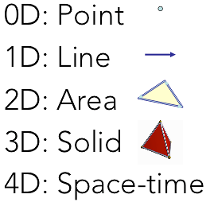

% Getting Data Science with R and ArcGIS
% Shaun Walbridge; Mark Janikas; Marjean Pobuda

<section data-background="images/title-bg.png">
<h3 class="med">[``https://github.com/scw/r-devsummit-2016-talk``](https://github.com/scw/r-devsummit-2016-talk)</h2>
<h3>[Handout PDF](https://4326.us/esri/r/devsummit-2016-data-science-r-arcgis-presentation-handout.pdf)</h3>
<h3>[High Quality PDF (4MB)](https://4326.us/esri/r/devsummit-2016-data-science-r-arcgis-presentation-full.pdf)</h3>
<h3>[Resources Section](https://4326.us/esri/r/#resources)</h3>
</section>

Data Science {data-background="images/bg-3.png"}
============

Data Science {data-background="images/bg-3.png"}
------------

 * A much-hyped phrase, but effectively is about the application of statistics and machine learning to real-world data, and developing formalized tools instead of one-off analyses. Combines diverse fields to solve problems.

Data Science {data-background="images/bg-3.png"}
------------

What's a data scientist?

<div class="left">
> “A data scientist is someone who is better at statistics than
> any software engineer and better at software engineering than
> any statistician.”<br>
> &nbsp;&nbsp;&mdash; [Josh Wills](https://twitter.com/josh_wills/status/198093512149958656)
</div>

Data Science {data-background="images/bg-3.png"}
------------

Us geographic folks also rely on knowledge from multiple domains. We know that spatial is more than just an ``x`` and ``y`` column in a table, and how to get value out of this data.

<div class="notes">

Geography has a similar relationship, domain knowledge on top of the spatial

> "A data scientist is a statistician who lives in San Francisco".

Like the Geographic: a similar relationship between our domain and the knowledge we need which spans into other domains. Stats is similar -- can't do it without someone else's data!

Goodchild bit: difference is for stats, methods came hundred years ago (e.g. Bayes Method), but only recently have we had the ability to actually compute it for hard problems. GIS is the other way around: data came first, we built up methods around it.
</div>

Data Science Languages {data-background="images/bg-3.png"}
------------

Languages commonly used in data science:

 {class="tight" style="width:32px"} R &mdash;{class="tight" style="width:32px"} Python &mdash; {class="tight" style="width:32px"} Matlab &mdash; {class="tight" style="width:32px"} Julia

We're a big Python shop, so why R?

[R vs Python for Data Science](http://www.kdnuggets.com/2015/05/r-vs-python-data-science.html)

<div class="notes">
[really the case? just perhaps highlight these four, many others... SQL, classic languages, ...]
</div>

R {data-background="images/bg-3.png"}
======

Why {class="tight" style="width: 96px"}? {data-background="images/bg-3.png"}
------

 - Powerful core data structures and operations 
    + Data frames, functional programming
 - Unparalleled breadth of statistical routines
    + The _de facto_ language of Statisticians
 - `CRAN`: 6400 packages for solving problems
 - Versatile and powerful plotting

. . . 

<br>

 - We assume basic proficiency programming
 - See resources for a deeper dive into R

<div class="notes">

Share the essence of the language.

Open source -- GPL

Written in C -- some parts are very fast, others less so. R code is relatively pokey.

CRAN is epic. Get immediate access to best of breed methods, written by domain experts.

</div>

R Data Types {data-background="images/bg-3.png"}
------------

[Data types](https://en.wikipedia.org/wiki/Data_type) you're used to seeing...

`Numeric` - `Integer` - `Character` - `Logical` - `timestamp`

. . .

... but others you probably aren't:

`vector` - `matrix` - `data.frame` - `factor`

R Data Types {data-background="images/bg-3.png"}
------------

<div style="float: right; width: 300px">

</div>

Vector:

```r
a.vector <- c(4, 3, 8, 7, 1, 5)
```

Matrix:

```r
A = matrix(
    c(4, 3, 8, 7, 1, 5), # same data as above
    nrow=2, ncol=3, # what's the shape of the data?
    byrow=TRUE) # what order are the values in?
```

R Data Types {data-background="images/bg-3.png"}
------------

Data Frames:

 - Treats tabular (and multi-dimensional) data as a labeled, indexed series of observations. Sounds simple, but is a game changer over typical software which is just doing 2D layout (e.g. Excel)

R Data Types {data-background="images/bg-3.png"}
------------

```r
# Create a data frame out of an existing tabular source
df.from.csv <- read.csv("data/growth.csv", header=TRUE)

# Create a data frame from scratch
quarter <- c(2, 3, 1) 
person <- c("Goodchild", "Tobler", "Krige") 
met.quota <- c(TRUE, FALSE, TRUE)
df <- data.frame(person, met.quota, quarter) 
```

```r
R> df
     person met.quota quarter
1 Goodchild      TRUE       2
2    Tobler     FALSE       3
3     Krige      TRUE       1
```
<div class="notes">
Many packages define their own objects, conversion is an important step in any analysis dealing with higher order objects beyond simple data frames.
</div>

``sp`` Types {data-background="images/bg-3.png"}
------------

<div style="float: left; width: 50%;">
  - 0D: ``SpatialPoints``
  - 1D: ``SpatialLines``
  - 2D: ``SpatialPolygons``
  - 3D: Solid
  - 4D: Space-time
</div>

<div>

</div>

Entity + Attribute model

<div class="notes">
Spatial types class for R. Solids and space time are both 'in development', nothing directly in ``sp`` but folks are working on this.

Also a `raster` package, but not covering this today.
</div>

Data Science with R {data-background="images/bg-7.png"}
===================

Hadley Stack {data-background="images/bg-7.png"}
------------

 - [Hadley Wickham](http://priceonomics.com/hadley-wickham-the-man-who-revolutionized-r/)
 - Developer at R Studio, Professor at Rice University
 - ``ggplot2``, ``scales``, ``dplyr``, ``devtools``, many others

{style="width: 600px"}

Statistical Formulas {data-background="images/bg-7.png"}
--------------------

```r
fit.results <- lm(pollution ~ elevation + rainfall + ppm.nox + urban.density)
```

 - Domain specific language for statistics
 - Similar properties in other parts of the language
 - [``caret``](https://cran.r-project.org/web/packages/caret/vignettes/caret.pdf) for model specification consistency

Literate Programming {data-background="images/bg-7.png"}
--------------------

<div class="left">
> I believe that the time is ripe for significantly better documentation of 
> programs, and that we can best achieve this by  considering programs to be 
> works of literature.<br>
> &nbsp;&nbsp;&mdash; Donald Knuth, “Literate Programming”
</div>

 * packages: ``RMarkdown``, ``Roxygen2``
 * Jupyter notebooks

<div class="notes">
What does this mean? You can interweave text with documentation fluidly, makes 'living documents' possible. Can have code embedded...
</div>

Development Environments {data-background="images/bg-7.png"}
------------------------

 * {class="tight" style="width: 150px"}
 * {class="tight" style="width: 180px"} _née IPython_
 * [R Tools for Visual Studio](http://blog.revolutionanalytics.com/2016/01/r-coming-to-visual-studio.html) _brand new_

. . .

<br> 

 * Best of class tools for interacting with data.

``dplyr`` Package {data-background="images/bg-7.png"}
---------

```r
Batting %.%
  group_by(playerID) %.%
  summarise(total = sum(G)) %.%
  arrange(desc(total)) %.%
  head(5)
```

[Introducing dplyr](http://blog.rstudio.org/2014/01/17/introducing-dplyr/)

<div class="notes">
In depth from Cam's workshop:
    filter() – Subset rows from a data frame.  Similar in function to base R subsetting.
    filter(crime_df, Arsons > 3, Thefts > 10)
    arrange() – Sort rows in a data frame based on a set of column names.  Can sort by multiple different columns.
    arrange(crime_df, Arsons, Assaults)
    select() – Select specified columns (or variables) from a data frame.
    select(crime_df, AREA_S_CD, Equity_Score)
    summarize() – Summarize values from a data frame given a function, and collapse results to a single row (unless data are grouped).
    summarize(crime_df,
            mean_fire = mean(Fire.Vehicle.Incidents, na.rm = TRUE))
    summarize_each() – Summarize values from a data frame given multiple functions.
    summarize_each(crime_df, c('mean', 'sd'), Equity_Score)
    %>% (Forward-pipe operator) – Allows you to pipe a value forward into an expression or function call, e.g., f(x, y) become x %>% f(y).
    crime_df %>%
    filter(Assaults == 0) %>%
    select(Equity_Score, Thefts) %>%
    arrange(Thefts)
    group_by() – Group a data frame given a variable (or list of variables).Groups will be used when you apply functions to this data frame.
    arson_groups = group_by(crime_df, Arsons)
    summarize(arson_groups, mean_fire = mean(Fire.Vehicle.Incidents, na.rm = TRUE))
    Adding an underscore to the end of any of these functions (e.g., arrange_()) to be able to pass parameters as lists (or more so, vectors).
    sort_fields = c('Arsons', 'Thefts')
    arrange_(crime_df, .dots = sort_fields)

</div>

R Challenges {data-background="images/bg-7.png"}
------------

 - Performance issues
 - Not a general purpose language
 - Lacks purely UI mode of interaction (e.g. plots must be manually specified)
 - Programmer only. There is ``shiny``, but R is first and foremost a language that expects fluency from its users

<div class="notes">
R without underlying C code can be slow. More challenging, R is by design an in-memory language, and each operation creates a new in-memory copy of the data structure. Working with large files can be problematic, typically heavy R users invest in lots of RAM.
</div>

R &mdash; ArcGIS Bridge {data-background="images/intro-bg.jpg"}
===============

<div class="notes">
Delicate Arch at Night: https://commons.wikimedia.org/wiki/File:Delicate_Arch_at_Night_%288708111489%29.jpg
</div>

R &mdash; ArcGIS Bridge {data-background="images/bg-7.png"}
---------------

{style="border: none"}

 - ArcGIS developers can create custom tools and toolboxes that integrate ArcGIS and R
 - ArcGIS users can access R code through geoprocessing scripts
 - R users can access organizations GIS' data, managed in traditional GIS ways

[https://r-arcgis.github.io](https://r-arcgis.github.io/)

<div class="notes">
The project serves three roles:

 - Allows developers with experience with R and ArcGIS to create custom tools and toolboxes that integrate ArcGIS and R, both for their own use, and for building toolboxes to share with others both within their organization and with other ArcGIS users.
 - R developers can quickly access ArcGIS datasets from within R, save R results back to ArcGIS datasets and tables, and easily convert between ArcGIS datasets and their equivalent representations in R via the sp package.
 -  Allows our users to integrate R into their workflows, without necessarily learning the R programming language directly.

 - Building tools with ArcGIS and R
    + architecture + performance, round tripping data. ``sp`` objects.
    + example of R + GP workflow
    + building your own packages


</div>

R &mdash; ArcGIS Bridge {data-background="images/bg-7.png"}
---------------

Store your data in ArcGIS, access it quickly in R, return R objects back to ArcGIS native data types (e.g. geodatabase feature classes).

Knows how to convert spatial data to ``sp`` objects.

[Package Documentation](https://r-arcgis.github.io/assets/arcgisbinding.pdf)

ArcGIS vs R Data Types {data-background="images/bg-7.png"}
-------------------

ArcGIS | R | Example Value
----------- | ------ | -------------
Address Locator | Character | `Address Locators\\MGRS`
Any | Character | &nbsp;
Boolean | Logical | &nbsp;
Coordinate System | Character | `"PROJCS[\"WGS_1984_UTM_Zone_19N\"...`
Dataset | Character |  `"C:\\workspace\\projects\\results.shp"`
Date | Character | `"5/6/2015 2:21:12 AM"`
Double | Numeric | 22.87918

ArcGIS vs R Data Types {data-background="images/bg-7.png"}
-------------------

ArcGIS | R | Example Value
----------- | ------ | -------------
Extent | Vector (xmin, ymin, xmax, ymax) | c(0, -591.561, 1000, 992)
Field | Character | &nbsp;
Folder | Character | full path, use with e.g. `file.info()`
Long | Long | 19827398L
String | Character | &nbsp;
Text File | Character | full path
Workspace | Character | full path


Access ArcGIS from R {data-background="images/bg-7.png"}
------------------------

Start by loading the library, and initializing connection to ArcGIS:

```r
# load the ArcGIS-R bridge library
library(arcgisbinding)
# initialize the connection to ArcGIS. Only needed when running directly from R.
arc.check_product()
```

Access ArcGIS from R {data-background="images/bg-7.png"}
------------------------

Opening data has two stages, like data cursors: 

 - Open data source with ``arc.open``
 - Select with filtering with ``arc.select``

Similar to using ``arcpy.da`` cursors

Access ArcGIS from R {data-background="images/bg-7.png"}
------------------------

First, select a data source (can be a feature class, a layer, or a table):
```r
input.fc <- arc.open('data.gdb/features')
```
Then, filter the data to the set you want to work with (creates in-memory data frame):
```r
filtered.df <- arc.select(input.fc, 
                          fields=c('fid', 'mean'),
                          where_clause="mean < 100")
```

This creates an _ArcGIS data frame_ -- looks like a data frame, but retains references back to the geometry data.

Access ArcGIS from R {data-background="images/bg-7.png"}
--------------------

Now, if we want to do analysis in R with this spatial data, we need it to be represented as ``sp`` objects. ``arc.data2sp`` does the conversion for us:

```r
df.as.sp <- arc.data2sp(filtered.df)
```

``arc.sp2data`` inverts this process, taking ``sp`` objects and generating ArcGIS compatible data frames.

Access ArcGIS from R {data-background="images/bg-7.png"}
------------------------

Finished with our work in R, want to get the data back to ArcGIS. Write our results back to a new feature class, with ``arc.write``:

```r
arc.write('data.gdb/new_features', results.df)
```

Access ArcGIS from R {data-background="images/bg-7.png"}
------------------------

WKT to proj.4 conversion:
```r
arc.fromP4ToWkt, arc.fromWktToP4
```

Interacting directly with geometries:
```r
arc.shapeinfo, arc.shape2sp
```
Geoprocessing session specific:

```r
arc.progress_pos, arc.progress_label, arc.env (read only)
```

Building R Script Tools {data-background="images/bg-7.png"}
-----------------------

{class="tight" style="height:32px"} 

{style="height:500px;"}

Building R Script tools {data-background="images/bg-7.png"}
-----------------------

{class="tight" style="height:32px"} 

```r
tool_exec <- function(in_params, out_params) {
  # the first input parameter, as a character vector
  input.features <- in_params[[1]]

  # alternatively, can access by the parameter name:
  input.input <- in_params$input_features
  print(input.dataset)
  # ... next, do analysis steps

  # this will be returned as the "Output Graphs" parameter.
  out_params[[1]] <- plot(results.dataset)
  return(out_params)
}
```

R ArcGIS Bridge Demo {data-background="images/bg-7.png"}
--------------------

* Details of model based clustering analysis in the [R Sample Tools](https://github.com/R-ArcGIS/r-sample-tools)

The How and Where {data-background="images/bg-7.png"}
=================

How To Install {data-background="images/bg-7.png"}
--------------

* Install with the [R bridge install](https://github.com/R-ArcGIS/r-bridge-install)
* [Detailed installation instructions](https://github.com/R-ArcGIS/r-bridge-install#installation)

Where Can I Run This? {data-background="images/bg-7.png"}
---------------------


Where Can I Run This? {data-background="images/bg-7.png"}
---------------------
 * Now: 
    - First, [install R](https://cran.r-project.org/bin/windows/base/) 3.1 or later
    - ArcGIS Pro (64-bit) 1.1 or later
    - ArcGIS 10.3.1 or later:
        + 32-bit R by default in Desktop
        + 64-bit R available via Server and Background Geoprocessing
 * Upcoming:
    - Conda for managing R environments

<div class="notes">

32-bit version required for ArcMap, 64-bit version required for ArcGIS Pro (Note: the installer installs both by default).

64-bit version can be used with ArcGIS Pro, or with ArcMap by installing Background Geoprocessing and configuring scripts to run in the background. NOTE: Background Geoprocessing only allows using the bridge from ArcGIS, not from within R itself.

possible future improvements:
  - Conda for managing R environments
  - raster support
</div>

Resources {data-background="images/bg-3.png"}
=========

Other Sessions {data-background="images/bg-3.png"}
--------------

 - [Integrating Open-source Statistical Packages with ArcGIS](https://devsummit.schedule.esri.com/#schedule/56b2873e4be5dd46a3000287/56b2873e4be5dd46a3000288)
 - [Python: Developing Geoprocessing Tools](https://devsummit.schedule.esri.com/#schedule/56b287284be5dd46a3000171/56b287284be5dd46a3000172)
 - [Harnessing the Power of Python in ArcGIS Using the Conda Distribution](https://devsummit.schedule.esri.com/#schedule/56b287364be5dd46a3000235/56b287364be5dd46a3000236)
 - [Python: Working with Scientific Data](https://devsummit.schedule.esri.com/#schedule/56b2873f4be5dd46a300028d/56b2873f4be5dd46a300028)

R {data-background="images/bg-3.png"}
-

Looking for a package to solve a problem? Use the [CRAN Task Views](https://cran.r-project.org/web/views/).

Tons of good books and resources on R available, check out the [RSeek](http://rseek.org/) engine to find resources for the language which can be difficult to locate because of the name.

[R Packages by Hadley Wickham](http://r-pkgs.had.co.nz/)

Spatial R / Data Science {data-background="images/bg-3.png"}
------------------------

 - [An Introduction to Staistical Learning (PDF)](http://www-bcf.usc.edu/~gareth/ISL/ISLR%20Sixth%20Printing.pdf) [website](http://www-bcf.usc.edu/~gareth/ISL/getbook.html) A free and accessible version of the classic in the field, _Elements of Statistical Learning_.

 - [Getting Started in Data Science](http://treycausey.com/getting_started.html)

ArcGIS + R {data-background="images/bg-3.png"}
-----------

 * [UC Plenary Demo: Statistical Integration with R](http://video.esri.com/watch/4651/statistical-integration-with-r)
    + Demo of [SSN: spatial modeling on stream networks](https://cran.r-project.org/web/packages/SSN/index.html)
 * Cam Plouffe (Esri CA) ran an [R ArcGIS Workshop](https://github.com/cplouffe/r-arcgis-workshop), covers materials in more depth.

Materials {data-background="images/bg-3.png"}
----------

 Courses:

 - [High Performance Scientific Computing](https://www.coursera.org/course/scicomp)
 - [The Data Scientist's Toolbox](https://www.coursera.org/course/datascitoolbox)

 Books:

 - [Spatial Statistical Data Analysis for GIS Users](http://www.esri.com/news/releases/11-2qtr/esri-press-releases-spatial-statistical-data-analysis-for-gis-users.html) Konstantin Krivoruchko (GA creator) 
    + Too big to print. Tons of useful stuff, covers both R and ArcGIS extensively.

Packages {data-background="images/bg-3.png"}
--------

Clustering demo covers `mclust` and `sp`.

 - Tree-based models, e.g. [CART](http://www.statmethods.net/advstats/cart.html)
 - Time series data, e.g. [Little Book of R](https://a-little-book-of-r-for-time-series.readthedocs.org/en/latest/)

R ArcGIS Extensions {data-background="images/bg-3.png"}
----------------------------

 - [R ArcGIS Bridge](https://r-arcgis.github.io/)
 - [Marine Geospatial Ecology Tools (MGET)](http://mgel.env.duke.edu/mget/)
    + Combines Python, R, and MATLAB to solve a wide variety of problems
 - [Geospatial Modeling Environment](http://www.spatialecology.com/gme/)
    + An R flavored language for spatial analysis

Conferences {data-background="images/bg-3.png"}
-----------

 - [useR! Conference](http://user2016.org//)
    + useR 2016 is being held at Stanford June 27-30
 - [Open Data Science Conference (ODSC)](http://www.odsc.com)
    + Many happening around world, some upcoming ones:
      - ODSC East May 20-22 in Boston
      - ODSC West Nov 4-6 in Santa Clara

Closing {data-background="images/bg-5.png"}
=======

Outreach {data-background="images/bg-5.png"}
--------

 - Resources and outreach -- connect the dots, want this to be outreach so we can build up more R + ArcGIS people who aren't as common as our core language folks.
 - Future of the project, questions

Community {data-background="images/bg-5.png"}
---------

 - Open source project, different ethos
 - Contributions are the currency
    + That said, major uptake in the commercial space:
    + Microsoft R (bought Revolution Analytics); R Studio
 - Our involvement:
    + Recently hosted a Space-time Statistics Summit
    + More soon

Thanks {data-background="images/bg-5.png"}
------

 - R team: Dmitry Pavlushko, Steve Kopp, Konstantin Krivoruchko; today's speakers 
    + <a href=mailto:r_bridge@esri.com>Contact Us</a>
 - Geoprocessing Team

Rate This Session {data-background="images/bg-5.png"}
-----------------

**iOS, Android**: Feedback from within the app

. . . 

**Windows Phone, or no smartphone?** Cuneiform tablets accepted.

{style="border: none; background: none; box-shadow: none;"}

<span style="display:none">fin</span> {data-background="images/end.png"}
---

